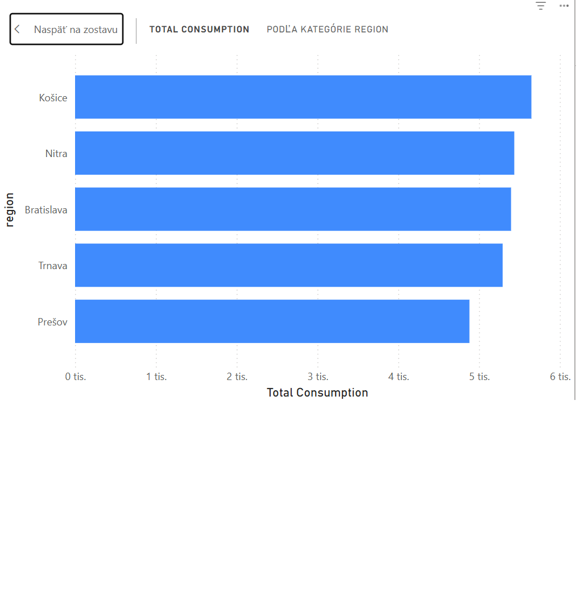
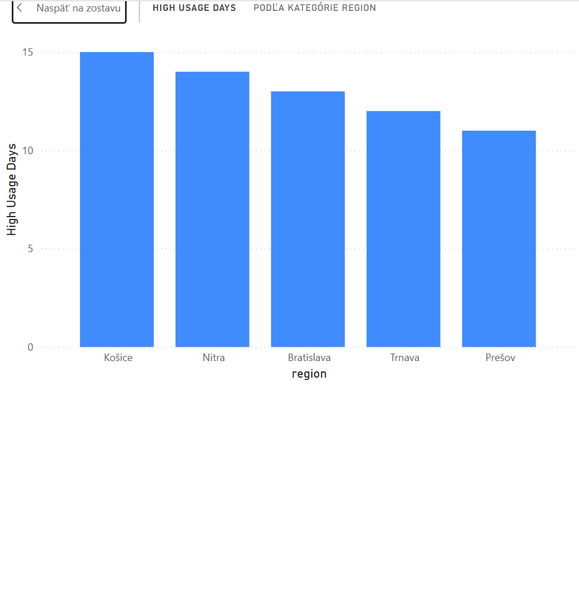
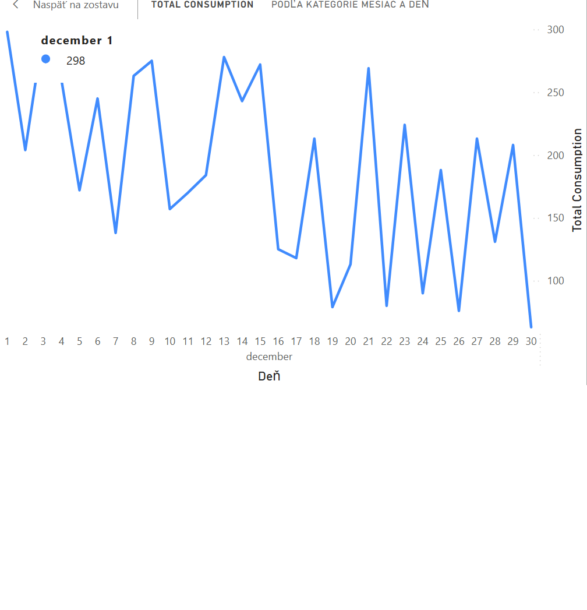

# Spotreba energie podľa regiónov – Power BI Dashboard

Tento projekt prezentuje Power BI dashboard zameraný výhradne na regionálnu analýzu spotreby energie. Všetky vizualizácie porovnávajú spotrebu medzi regiónmi alebo zobrazujú vývoj spotreby v čase rozdelený podľa regiónov.

Projekt je vhodný ako portfóliová ukážka Power BI zručností vrátane práce s measures, vizualizáciami a analytickým myslením.

### Ciele projektu:
* Porovnať celkovú spotrebu energie podľa regiónov
* Identifikovať regióny s najvyšším počtom dní s vysokou spotrebou (High Usage Days)
* Analyzovať časový trend spotreby energie pre jednotlivé regióny
* Poskytnúť prehľadné a zrozumiteľné vizualizácie pre regionálne rozhodovanie

---

### Vizualizácie:

#### 1. Clustered Bar Chart – Total Consumption by Region
Graf porovnáva celkovú spotrebu energie medzi jednotlivými regiónmi a umožňuje rýchlo identifikovať regióny s najvyššou energetickou záťažou.

* *Y-axis:* Region
* *X-axis:* Total Consumption (measure)
* *Analytický účel:* Regionálne porovnanie spotreby

*Obrázok:*



#### 2. Clustered Bar Chart – High Usage Days by Region
Graf zobrazuje počet dní s vysokou spotrebou energie pre jednotlivé regióny, čím identifikuje regióny s častými špičkami spotreby.

* *Y-axis:* Region
* *X-axis:* High Usage Days (measure)
* *Analytický účel:* Identifikácia regionálnych rizík

*Obrázok:*



#### 3. Line Chart – Energy Consumption Trend by Region
Line chart analyzuje vývoj spotreby energie v čase rozdelený podľa regiónov. Umožňuje porovnať trendy, sezónnosť a dlhodobý vývoj medzi regiónmi.

* *X-axis:* Date
* *Y-axis:* Total Consumption (measure)
* *Legend:* Region
* *Analytický účel:* Regionálna časová analýza

*Obrázok:*



---

### Použité nástroje a dáta
* *Power BI Desktop* – tvorba dashboardu a dátového modelu
* *Dataset obsahuje:* region, date, consumption (kWh)
* *Measures (DAX):* Total Consumption, High Usage Days

### Hlavné výstupy dashboardu
* Jasné porovnanie spotreby medzi regiónmi
* Identifikácia regiónov s vysokou energetickou záťažou
* Prehľadný pohľad na časový vývoj spotreby podľa regiónov

*Autor:* Tibor Pukluš, M.Sc.

---

### Štruktúra projektu:

```text
PowerBI-Dashboard/
│
├── scripts/
│   └── generate_energy_data.py   👈 tvoj .py
├── data/
│   └── energy_data.csv
├── reports/
├── images/
└── README.md
